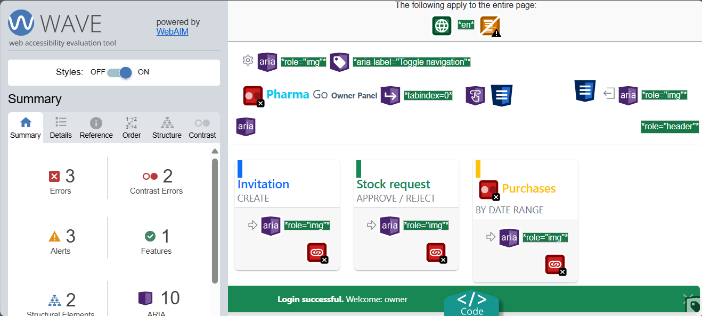
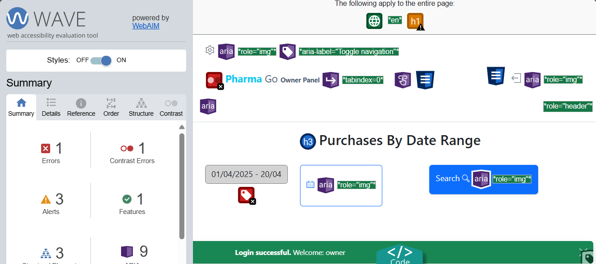
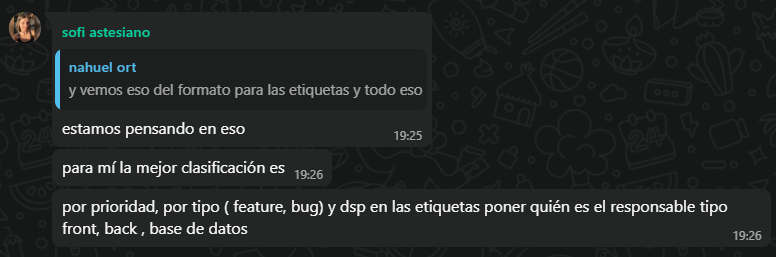

# Entrega 1

## Definición de marco de gestión basado en Kanban. Roles y ceremonias. 

Para definir los roles y ceremonias del marco de gestión, se tomaron algunos elementos del marco de gestión SCRUM. Como lo indica la letra, todos los miembros del equipo tomarán el rol de desarrolladores y testers en todas las etapas. Por otro lado, se definió un Product Owner para cada entrega, quien definirá y priorizará las tareas a realizar, y se asegurará que las tareas realizadas estén alineadas con lo solicitado por el usuario. En esta primera entrega, este rol lo asumirá Sofía. 

Se definieron las siguientes ceremonias:
-	Reunión semanal: Elegir tareas a hacer, asignar responsables y ordenar prioridades. 
-	Revisión de entrega: Al finalizar cada entrega validar con el PO los avances realizados. 
-	Retrospectiva: Al final de cada entrega reflexionar como equipo, para ver qué funcionó, qué no y qué mejorar.
-	Reuniones esporádicas: En caso de ser necesario, ya sea por bloqueos, dudas o algún problema que surja, cualquier integrante del equipo puede solicitar realizar una reunión con el resto del equipo. 

En el momento de las reuniones, se utilizó la extensión de Visual Studio Code: Live Share, para ir documentando en simultaneo.

## Definición de un primer proceso de ingeniería.

Como se mencionó previamente, el marco de gestión a utilizar es Kanban. En principio, se decidió comenzar con un tablero simple, con tres columnas: _To Do_, _Doing_ y _Done_. En la columna Backlog se ubicarán todas las tareas a realizar, priorizadas por el PO en cada etapa. En la columna Doing se ubicarán las tareas que están en proceso, y en la columna _Done_ se ubicarán las tareas que fueron finalizadas.  Este tablero será gestionado desde GitHub Proyects y las columnas se irán modificando a medida que el proyecto avance. 

Para que una tarea pueda avanzar de una columna a otra, se definieron los siguientes criterios:
-	Backlog a Doing: La tarea debe estar asignada a un responsable y el PO debe validar que la tarea esté lista para comenzar.
-	Doing a Done: La tarea debe estar finalizada y el PO debe validar que la tarea cumpla con los criterios de aceptación definidos.

Todos los integrantes del equipo contribuirán a la creación de tareas, y estas se ubicarán en el tablero a medida que se analice el sistema y se descubran nuevas oportunidades de mejora o errores. A cada tarea se le asignará una prioridad (alta, media o baja) y un responsable, y dependiendo de la necesidad, se comenzará como un borrador (draft) o como un issue. Los issues se podrán crear a partir de plantillas si corresponde, o de cero siguiendo un formato estructurado. Además, para facilitar el flujo de trabajo, no se asignarán tipos a las tareas, y solo se le asignará como máximo una tarea a cada integrante del equipo por vez.

En cuanto a los pull requests (PR), estos serán creados cada vez que los integrantes del equipo tengan cambios listos para ser integrados al código base. El PR deberá estar asociado a un issue o tarea especifíca, y deberá ser revisado por al menos un integrante del equipo antes de realizarse el merge. Además, los PR deberán superar los controles de calidad, que incluyen pruebas unitarias y de integración, y revisiones de código.

## Configuración del repositorio en GitHub: archivos y directorios, estrategia de branching, estándares de nomenclatura. 

Para mantener un trabajo ordenado y colaborativo, se definió utilizar como base la estructura de carpetas proporcionada por los docentes. El repositorio está organizado de la siguiente manera:

**Código**: contiene los dos proyectos principales que conforman la aplicación, es decir, el backend y el frontend.

**Documentación**: incluye los informes entregados por los autores originales del proyecto, así como los requerimientos iniciales definidos.

**Base de Datos**: almacena los scripts necesarios para la creación de la base de datos y sus datos de prueba.

**Exportations**: contiene los archivos generados al exportar datos desde la aplicación.

**Informes de avance**: directorio creado para colocar la documentación correspondiente a cada una de las entregas del equipo.

En cuanto a la estrategia de branching, para esta primera entrega no se implementó una metodología compleja, ya que el trabajo se centró principalmente en tareas de documentación. Por lo tanto, se creó una rama entrega-1, que será mergeada a main al final de la iteración.

Para las siguientes iteraciones se adoptará la estrategia Git Flow, que implica la creación de una rama develop como base de desarrollo, desde la cual se derivarán ramas específicas para nuevas funcionalidades (feature), correcciones (hotfix) y otras necesidades del proyecto.

Respecto a los estándares de nomenclatura, se acordó el uso de nombres descriptivos y consistentes tanto para las ramas como para los commits. Las ramas seguirán el formato <tipo>/<descripción-corta>, por ejemplo: feature/login-usuario o hotfix/fix-error-login. En cuanto a los mensajes de commit, se busca que sean breves pero claros, utilizando verbos en infinitivo.

## Análisis de deuda técnica y gestión de la calidad: definición de un modelo de calidad y un análisis de deuda técnica en base a ese modelo de calidad. 

### Modelo de Calidad

El sistema desarrollado por la startup tiene como objetivo principal facilitar la búsqueda y adquisición de medicamentos, así como la gestión interna de farmacias, con usuarios que poseen distintos perfiles. Por esta razón, se decidió adoptar un modelo de calidad centrado en los siguientes atributos, derivados de las normas [ISO/IEC 25010](https://iso25000.com/index.php/normas-iso-25000/iso-25010?start=6):

**Capacidad de interacción y/o usabilidad**

El sistema será utilizado por usuarios no técnicos, como empleados y dueños de farmacia, y también por usuarios anónimos que acceden desde la web. Por lo tanto, la interfaz debe ser intuitiva, clara y fácil de navegar. Para garantizar esto, se busca que la aplicación cumpla criterios como:

- Operabilidad: es importante que el usuario sea capaz de acceder y realizar las distintas operaciones que la aplicación ofrece de manera fácil. Por ejemplo, que exista un botón de login en la página de inicio, y la posibilidad de volver a la página anterior, entre otros.

- Aprendabilidad y protección contra errores: para esto, es necesario que el sistema tenga flujos de interacción consistentes, con validaciones claras y mensajes de error comprensibles para el usuario.

- Inclusividad: el sistema debe ser accesible para personas con discapacidades, por lo que se deben seguir las pautas de accesibilidad web (WCAG). Para ello, se utilizarán herramientas como WAVE y Lighthouse para verificar que la aplicación cumpla con los estándares de accesibilidad.

**Mantenibilidad** 

Se busca que el sistema tenga la capacidad para ser modificado de forma eficiente ante cambios y mejoras.

Para asegurar una buena mantenibilidad se tendrán en cuenta los siguientes criterios:

- Modificabilidad: capacidad del producto que permite que sea modificado de froma efectiva sin degradar la calidad. Esto incluye el uso de buenas prácticas como la separación de responsabilidades y la división en capas. 

- Legibilidad y simplicidad del código: Se espera un código claro, limpio y fácil de entender. Esto implica métodos cortos, nombres de variables claros, evitar código duplicado y mantener una organización coherente de los archivos y carpetas. 

- Capacidad para ser probado: El sistema debe estar acompañado de una buena base de pruebas que permitan verificar el correcto funcionamiento del código luego de cualquier modificación. 
 

### Análisis de la deuda técnica

Teniendo en cuenta el modelo de calidad definido anteriormente, se identificaron algunas mejoras a tener en cuenta:

**Usabilidad** 

Como se mencionó anteriormente, tanto la operabilidad como la aprendabilidad y accesiblidad son atributos muy importantes. Al analizar el sistema desde el punto de vista del cliente, se detectaron varias mejoras a realizar en este sentido.

En cuanto a la interacción en general, hay mensajes de error que no son muy claros hacia el usuario. A su vez, algunos formularios no tienen buenas descripciones en sus campos, lo que afecta negativamente la usabilidad. El flujo también se ve afectado por la operablidad incompleta, es decir que faltan elementos básicos como el botón de regresar o modales de confirmación antes de enviar formularios.

Por otro lado, la accesibilidad también es un punto a mejorar en la aplicación. Se ejecutó la herramienta WAVE en algunas pantallas, y en todas ellas se detectaron errores de contraste y falta de etiquetas en algunos campos.

Los puntos mencionados son factores que afectan el aprendizaje inicial del sistema por parte de nuevos usuarios y comprometen la experiencia de usuarios con discapacidades.

**Mantenibilidad**

Se identificaron varios apectos que afectan la calidad del software. En primer lugar se detectó un test que no funciona correctamente.
Ademas la cobertura general de pruebas no alcanza el 100%, lo que indica que hay código no utilizado o no testeado. Un ejemplo crítico es el ExportManager que actualmente no cuenta con ninguna cobertura de pruebas. 

Por otra parte, se observa una complejidad excesiva en ciertos métodos de los managers, los cuales presentan múltiples estructuras de control anidadas (if-else) que dificultan la comprensión del código. Para mejorar esto, se recomienda abstraer las validaciones en metodos mas pequeños promueve una mayor legibilidad. 

En cuanto al diseño de las entidades, se identifica una falta de responsabilidad propia, la mayoría delega las validaciones de sus atributos a los managers, mientras que otras tienen un método interno para este fin. Se observa que en muchos casos las entidades estan siendo creadas directamente desde los controllers, lo que va en contra del principio de responsabilidad unica. Esta lógica debería trasladarse a los managers.

## Definición de issues y clasificación.

Se decidió clasificar los issues siguiendo los siguientes criterios: 

- **Prioridad**: Determina el nivel de urgencia con el que debe ser corregido el issue. Alta, Media, Baja.
- **Tipo**: Identifica la naturaleza del issue. Se utilizará Feature cuando se trate de una nueva funcionalidad o mejora del sistema y Bug si es un error o comportamiento incorrecto. 
- **Responsable**: Indica el área principal a la que corresponde resolver el issue. Las categorías que se definieron inicialmente son: Base de datos, Backend, Frontend, Testing. 

## Registro de actividades realizadas.
El registro de actividades realizadas se encuentra en el archivo [registro-horas.xlsx](./registro-horas.xlsx).

## Mejoras en la calidad y evidencia de revisión con el PO (uno de los integrantes debe tomar el rol en cada etapa)

Dado que en esta primera entrega no se realizaron modificaciones en el código, no se puede afirmar que existan mejoras directas en la calidad del sistema. No obstante, la definición del modelo de calidad y el análisis de deuda técnica permitieron identificar áreas de mejora a desarrollar en las próximas entregas, lo que constituye una mejora indirecta en la calidad del sistema.

Por otro lado, en todas las reuniones realizadas estuvo presente el PO, Sofía, que validó los avances y estuvo de acuerdo con todos los puntos definidos anteriormente. 

## Retrospectiva y acciones de mejora

En esta primera entrega, el equipo logró seguir los roles y ceremonias definidas. El uso del tablero Kanban en GitHub Projects fue de gran utilidad para que todos los integrantes puedan ver el estado del flujo de trabajo en cualquier momento y poder aportar a las tareas de manera simple. 

Las plantillas para los issues y los tipos definidas fueron utilizados correctamente, pero se podría implementar un sistema de etiquetas para especificar aún más de qué tratan los issues. 

En la próxima entrega se espera realizar la asignación de las tareas a los integrantes del equipo, configurar los pipelines de CI/CD, y comenzar a trabajar en la implementación de las mejoras definidas en el análisis de deuda técnica y los bugs.